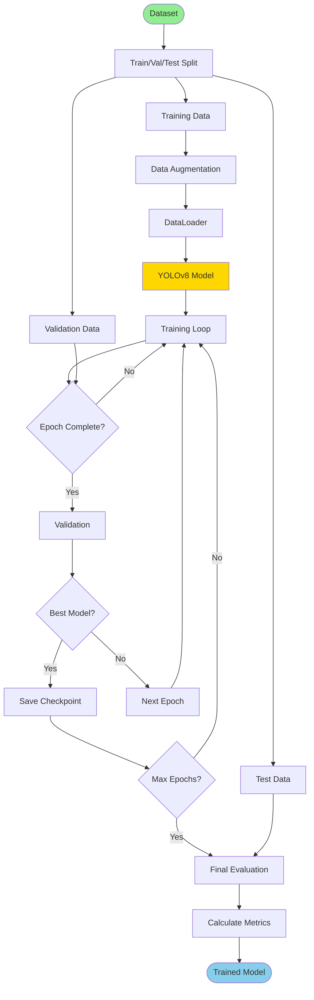
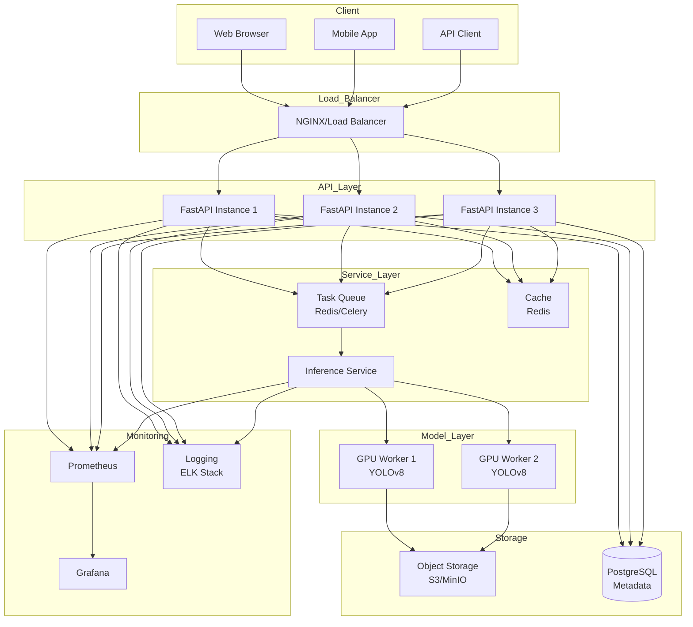
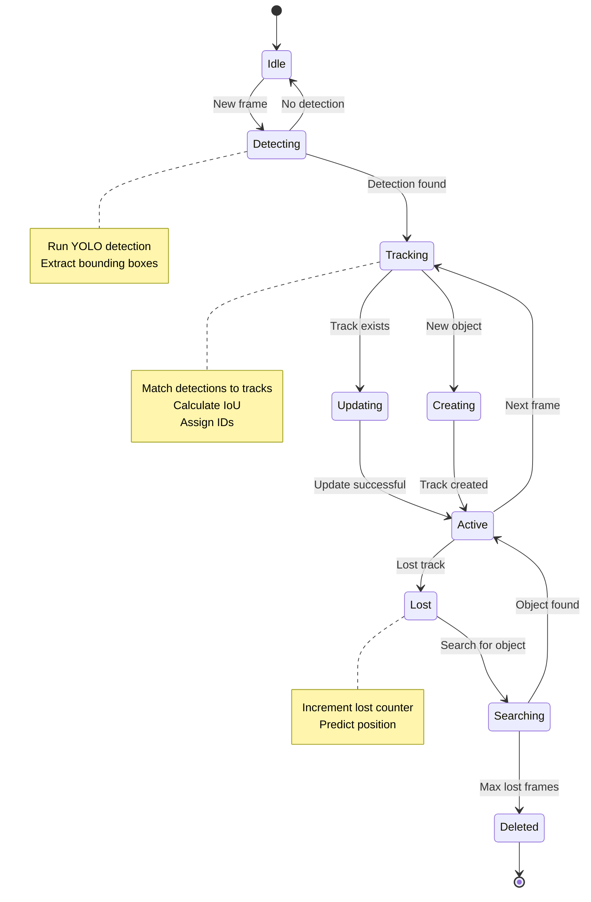

# Pet Detection Computer Vision - Architecture Diagrams

This document contains visual diagrams illustrating the project architecture, workflows, and data flows.

---

## Project Architecture

```
┌─────────────────────────────────────────────────────────────────────┐
│                            DATA LAYER                                │
├─────────────────────────────────────────────────────────────────────┤
│  ┌─────────────┐   ┌─────────────┐   ┌─────────────┐               │
│  │ Raw Images/ │   │  Processed  │   │ Annotations │               │
│  │   Videos    │   │    Data     │   │             │               │
│  └──────┬──────┘   └─────────────┘   └─────────────┘               │
└─────────┼───────────────────────────────────────────────────────────┘
          │
          ├──────────────────┬──────────────────┐
          │                  │                  │
          ▼                  ▼                  ▼
┌─────────────────────────────────────────────────────────────────────┐
│                        APPLICATION LAYER                             │
├─────────────────────────────────────────────────────────────────────┤
│  ┌─────────────┐   ┌─────────────┐   ┌─────────────┐               │
│  │   Image     │   │   Folder    │   │  Enhanced   │               │
│  │  Inference  │   │  Inference  │   │  Inference  │               │
│  └──────┬──────┘   └──────┬──────┘   └──────┬──────┘               │
│         │                 │                  │                       │
│         └─────────────────┴──────────────────┤                       │
└───────────────────────────────────────────────┼───────────────────────┘
                                                │
          ┌─────────────────────────────────────┤
          │                                     │
          ▼                                     ▼
┌──────────────────────┐         ┌─────────────────────────────────┐
│    MODEL LAYER       │         │    PROCESSING LAYER             │
├──────────────────────┤         ├─────────────────────────────────┤
│  ┌──────────────┐   │         │  ┌─────────────────────────┐   │
│  │ YOLOv8 Model │   │         │  │  Edge Detection         │   │
│  └──────────────┘   │         │  │  (Canny/Sobel/Laplace)  │   │
│  ┌──────────────┐   │         │  └─────────────────────────┘   │
│  │Model Weights │   │         │  ┌─────────────────────────┐   │
│  └──────────────┘   │         │  │  Keypoint Detection     │   │
└──────────────────────┘         │  │  (SIFT/ORB)             │   │
                                 │  └─────────────────────────┘   │
                                 │  ┌─────────────────────────┐   │
                                 │  │  Contour Detection      │   │
                                 │  └─────────────────────────┘   │
                                 └─────────────────────────────────┘
                                                │
                                                ▼
┌─────────────────────────────────────────────────────────────────────┐
│                          OUTPUT LAYER                                │
├─────────────────────────────────────────────────────────────────────┤
│  ┌─────────────┐   ┌─────────────┐   ┌─────────────┐               │
│  │ Detections  │   │    Logs     │   │   Metrics   │               │
│  └─────────────┘   └─────────────┘   └─────────────┘               │
└─────────────────────────────────────────────────────────────────────┘
```

---

## Inference Pipeline

```mermaid
flo
Input Image
    │
    ▼
┌─────────────┐
│ Load Image  │
└──────┬──────┘
       │
       ▼
┌─────────────────┐
│ Load YOLO Model │
└────────┬────────┘
         │
         ▼
┌──────────────────┐
│ Run Inference    │ ◄── Core Detection Step
└────────┬─────────┘
         │
         ▼
┌──
                        Input Image
                            │
                            ▼
                    ┌───────────────┐
                    │  Load Image   │
                    └───────┬───────┘
                            │
                            ▼
                    ┌───────────────┐
                    │ Enhancement?  │
                    └───┬───────┬───┘
                        │       │
        ┌───────────────┘       └───────────────┐
        │                                       │
        ▼                                       ▼
    Standard                                Enhanced
        │                                       │
        ▼                                       │
┌───────────────┐                              │
│ YOLO Only     │                              │
└───────┬───────┘                              │
        │                                       ▼
        │                    ┌──────────────────────────────────┐
        │                    │    PARALLEL PROCESSING           │
        │                    ├──────────────────────────────────┤
        │                    │  ┌────────────────────────┐     │
        │                    │  │  YOLO Detection        │     │
        │                    │  └────────────────────────┘     │
        │                    │  ┌────────────────────────┐     │
        │                    │  │  Edge Detection        │     │
        │                    │  │  - Canny               │     │
        │                    │  │  - Sobel               │     │
        │                    │  │  - Laplacian           │     │
        │                    │  └────────────────────────┘     │
        │                    │  ┌────────────────────────┐     │
        │                    │  │  Keypoint Detection    │     │
        │                    │  │  - SIFT                │     │
        │                    │  │  - ORB                 │     │
   
┌────────────────────────────────────────────────────────────────────────┐
│                              INPUT                                     │
├────────────────────────────────────────────────────────────────────────┤
│   ┌─────────┐        ┌─────────┐        ┌──────────────┐            │
│   │ Images  │        │ Videos  │        │ Webcam Stream│            │
│   └────┬────┘        └────┬────┘        └──────┬───────┘            │
└────────┼──────────────────┼────────────────────┼────────────────────┘
         │                  │                    │
         └──────────────────┴────────────────────┘
                            │
                            ▼
┌────────────────────────────────────────────────────────────────────────┐
│                         PREPROCESSING                                  │
├────────────────────────────────────────────────────────────────────────┤
│                     ┌──────────────┐                                   │
│                     │    Resize    │                                   │
│                     └──────┬───────┘                                   │
│                            │                                           │
│                     ┌──────▼───────┐                                   │
│                     │  Normalize   │                                   │
│                     └──────┬───────┘                                   │
│                            │                                           │
│                     ┌──────▼───────┐                                   │
│                     │ Augmentation │ (Optional - Training only)        │
│                     └──────┬───────┘                                   │
└────────────────────────────┼───────────────────────────────────────────┘
                             │
                             ▼
┌────────────────────────────────────────────────────────────────────────┐
│                          DETECTION                                     │
├────────────────────────────────────────────────────────────────────────┤
│                     ┌──────────────┐                                   │
│                     │   YOLOv8     │                                   │
│                     └──────┬───────┘                                   │
│                            │                                           │
│                     ┌──────▼────────────┐                              │
│                     │ Non-Max Suppression│                             │
│                     └──────┬────────────┘                              │
└────────────────────────────┼───────────────────────────────────────────┘
                             │
         ┌───────────────────┼───────────────────┐
         │                   │                   │
         ▼                   ▼                   ▼
┌─────────────────┐  ┌──────────────┐  ┌──────────────┐
│ Edge Features   │  │  Keypoints   │  │  Contours    │
│ - Canny         │  │  - SIFT      │  │              │
│ - Sobel         │  │  - ORB       │  │              │
│ - Laplacian     │  │              │  │              │
└────────┬────────┘  └──────┬───────┘  └──────┬───────┘
         │                   │                 │
         └───────────────────┴─────────────────┘
                             │
                             ▼
┌────────────────────────────────────────────────────────────────────────┐
│                       POSTPROCESSING                                   │
├────────────────────────────────────────────────────────────────────────┤
│                  ┌──────────────────────┐                              │
│                  │ Filter by Confidence │                              │
│                  └──────────┬───────────┘                              │
│                             │                                          │
│                  ┌──────────▼───────────┐                              │
│                  │   Visualization      │                              │
│                  └──────────┬───────────┘                              │
│                             │                                          │
│  
┌─────────────────────┐
│   ImageLoader       │
├─────────────────────┤
│ + load_image()      │
│ + validate_image()  │
└──────────┬──────────┘
           │ provides image
           ▼
┌─────────────────────────────┐
│      YOLODetector           │
├─────────────────────────────┤
│ - model: YOLO               │
│ - conf_threshold: float     │
├─────────────────────────────┤
│ + __init__(model_path)      │
│ + detect(image)             │
│ + get_predictions()         │
└──────────┬──────────────────┘
           │ predictions
           ▼
┌──────────────────────────────────────────────────┐
│                  Visualizer                      │
├──────────────────────────────────────────────────┤
│ + draw_detections(image, boxes)                  │
│ + draw_enhanced(image, boxes, features)          │
│ + overlay_edges(image, edges)                    │
│ + overlay_keypoints(image, keypoints)            │
└──────────┬───────────────────────────────────────┘
           │ final image
           ▼
┌────────────────────────┐
│   OutputManager        │
├────────────────────────┤
│ + save_image()         │
│ + save_predictions()   │
│ + log_metrics()        │
└────────────────────────┘

Enhancement Classes (provide features to Visualizer):

┌─────────────────────────┐
│    EdgeDetector         │
├─────────────────────────┤
│ + extract_canny()       │
│ + extract_sobel()       │────────┐
│ + extract_laplacian()   │        │
│ + extract_all_features()│        │ edge features
└─────────────────────────┘        │
                                   │
┌─────────────────────────┐        │
│   KeypointDetector      │        │
├─────────────────────────┤        │
│ + detect_sift()         │────────┤ keypoints
│ + detect_orb()          │        │
│ + draw_keypoints()      │        │
└─────────────────────────┘        │
                                   │
┌─────────────────────────┐        │
│  
main branch:     ●─────────────────────────●───────────────────────────●
                 │                         │                           │
              Initial                 v0.1.0 (merge)              v0.2.0
                 │                         ▲                           │
                 │                         │                           │
develop branch:  └─●───────●───────────────●───────────────────────●───┘
                   │       │               │                       │
                Setup  Integration     (merge from                 │
                   │       │            feature)                   │
                   │       │               │                       │
                   │       │               │                       │
feature/edge:      │       └───●───●───●───┘                       │
                   │           │   │   │                           │
                   │        Add  Add Tests                         │
                   │        edge kp                                │
                   │                                               │
                   │                                               │
feature/video:     └───────────────────────────────●───●───────────┘
                                                   │   │
                                                Video Real-time
                                                infer detect

Workflow Steps:
1. Create feature branch from develop
2. Make commits on feature branch
3. Merge feature to develop (--no-ff)
4. Test on develop
5. Merge develop to main for release
6. Tag release on main (v0.x.0)
    VIS --> ANNO
   
                         Git Push
                            │
                    ┌───────┴───────┐
                    │ Detect Branch │
                    └───────┬───────┘
                            │
        ┌───────────────────┼───────────────────┐
        │                   │                   │
        ▼                   ▼                   ▼
   feature/*            develop              main


FEATURE BRANCH          DEVELOP BRANCH         MAIN BRANCH
     CI                      CI                    CI
     │                       │                     │
     ▼                       ▼                     ▼
┌─────────────┐        ┌─────────────┐       ┌─────────────┐
│ Checkout    │        │ Checkout    │       │ Checkout    │
└──────┬──────┘        └──────┬──────┘       └──────┬──────┘
       │                      │                      │
       ▼                      ▼                      ▼
┌─────────────┐        ┌─────────────┐       ┌─────────────┐
│Setup Python │        │Setup Python │       │Setup Python │
│    3.11     │        │    3.11     │       │    3.11     │
└──────┬──────┘        └──────┬──────┘       └──────┬──────┘
       │                      │                      │
       ▼                      ▼                      ▼
┌─────────────┐        ┌─────────────┐       ┌─────────────┐
│  Install    │        │  Install    │       │  Install    │
│Dependencies │        │Dependencies │       │Dependencies │
└──────┬──────┘        └──────┬──────┘       └──────┬──────┘
       │                      │                      │
       ▼                      ▼                      ▼
┌─────────────┐        ┌─────────────┐       ┌─────────────┐
│Run Linting  │        │ Run Full    │       │ Run Full    │
│   (flake8)  │        │ Test Suite  │       │   Tests     │
└──────┬──────┘        └──────┬──────┘       └──────┬──────┘
       │                      │                      │
       ▼                      ▼                      ▼
┌─────────────┐        ┌─────────────┐       ┌─────────────┐
│  Run Tests  │        │  Generate   │       │    Build    │
│   (pytest)  │        │  Coverage   │       │   Package   │
└──────┬──────┘        └──────┬──────┘       └──────┬──────┘
       │                      │                      │
       ▼                      ▼                      ▼
┌─────────────┐        ┌─────────────┐       ┌─────────────┐
│   Check     │        │    Build    │       │   Upload    │
│  Coverage   │        │  Artifacts  │       │  Artifacts  │
└──────┬──────┘        └──────┬──────┘       └──────┬──────┘
       │                      │                      │
       └──────────────────────┴──────────────────────┘
                              │
                              ▼
   
User               VideoLoader    FrameExtractor    Detector       Tracker        Renderer       Output
 │                     │                │              │              │              │             │
 │ Load video         │                │              │              │              │             │
 ├────────────────────>│                │              │              │              │             │
 │                     │  Get frames    │              │              │              │             │
 │                     ├───────────────>│              │              │              │             │
 │                     │                │              │              │              │             │
 │                     │                │──────────────┐              │              │             │
 │                     │                │ Loop: For each frame         │              │             │
 │                     │                │<─────────────┘              │              │             │
 │                     │                │              │              │              │             │
 │                     │                │  Send frame  │              │              │             │
 │                     │                ├─────────────>│              │              │             │
 │                     │                │              │              │              │             │
 │                     │                │              │─────────┐    │              │             │
 │                     │                │              │ Run YOLO│    │              │             │
 │                     │                │              │<────────┘    │              │             │
 │                     │                │              │              │              │             │
 │                     │                │              │ Send detections              │             │
 │                     │                │              ├─────────────>│              │             │
 │                     │                │              │              │              │             │
 │                     │                │              │              │──────────┐   │             │
 │                     │                │              │              │Update    │   │             │
 │                     │                │              │              │tracks    │   │             │
 │                     │                │              │              │<─────────┘   │             │
 │                     │                │              │              │              │             │
 │                     │                │              │              │ Tracked objs │             │
 │                     │                │              │              ├─────────────>│             │
 │                     │                │              │              │              │             │
 │ 
                          Dataset
                             │
                             ▼
                    ┌─────────────────┐
                    │  Train/Val/Test │
                    │      Split      │
                    └────────┬────────┘
                             │
         ┌───────────────────┼───────────────────┐
         │                   │                   │
         ▼                   ▼                   ▼
  ┌──────────────┐   ┌──────────────┐   ┌──────────────┐
  │Training Data │   │Validation    │   │  Test Data   │
  │   (70%)      │   │Data (20%)    │   │   (10%)      │
  └──────┬───────┘   └──────┬───────┘   └──────┬───────┘
         │                   │                   │
         ▼                   │                   │
  ┌──────────────┐           │                   │
  │     Data     │           │                   │
  │ Augmentation │           │                   │
  │ - Rotation   │           │                   │
  │ - Flip       │           │                   │
  │ - Color      │           │                   │
  └──────┬───────┘           │                   │
         │                   │                   │
         ▼                   │                   │
  ┌──────────────┐           │                   │
  │ DataLoader   │           │                   │
  └──────┬───────┘           │                   │
         │                   │                   │
         ▼                   │                   │
  ┌──────────────┐           │                   │
  │ YOLOv8 Model │◄──────────┤                   │
  └──────┬───────┘           │                   │
         │                   │                   │
         ▼                   │                   │
  ┌──────────────┐           │                   │
  │ Training Loop│           │                   │
  │  (Batch SGD) │           │                   │
  └──────┬───────┘           │                   │
         │                   │                   │
   
┌────────────────────────────────────────────────────────────────────────┐
│                         CLIENT LAYER                                   │
├────────────────────────────────────────────────────────────────────────┤
│   ┌────────────┐      ┌────────────┐      ┌────────────┐             │
│   │    Web     │      │   Mobile   │      │    API     │             │
│   │  Browser   │      │    App     │      │   Client   │             │
│   └──────┬─────┘      └──────┬─────┘      └──────┬─────┘             │
└──────────┼────────────────────┼────────────────────┼───────────────────┘
           │                    │                    │
           └────────────────────┴────────────────────┘
                                │
                                ▼
┌────────────────────────────────────────────────────────────────────────┐
│                      LOAD BALANCER                                     │
│                   NGINX / HAProxy                                      │
└───────────────────────────┬────────────────────────────────────────────┘
                            │
        ┌───────────────────┼───────────────────┐
        │                   │                   │
        ▼                   ▼                   ▼
┌────────────────────────────────────────────────────────────────────────┐
│                        API LAYER                                       │
├────────────────────────────────────────────────────────────────────────┤
│  ┌──────────┐       ┌──────────┐       ┌──────────┐                  │
│  │ FastAPI  │       │ FastAPI  │       │ FastAPI  │                  │
│  │Instance 1│       │Instance 2│       │Instance 3│                  │
│  └────┬─────┘       └────┬─────┘       └────┬─────┘                  │
└───────┼──────────────────┼──────────────────┼────────────────────────┘
        │                  │                  │
        └──────────────────┴──────────────────┘
                           │
        ┌──────────────────┼──────────────────┐
        │                  │                  │
        ▼                  ▼                  ▼
┌────────────────┐  ┌────────────┐  ┌────────────────┐
│  Task Queue    │  │   Cache    │  │   Database     │
│ Redis/Celery   │  │   Redis    │  │  PostgreSQL    │
└───────┬────────┘  └────────────┘  └────────────────┘
        │
        ▼
┌────────────────────────────────────────────────────────────────────────┐
│                      SERVICE LAYER                                     │
│                   Inference Service                                    │
└───────────────────────────┬────────────────────────────────────────────┘
                            │
        ┌───────────────────┴───────────────────┐
        │                                       │
        ▼                                       ▼
┌────────────────────────────────────────────────────────────────────────┐
│                       MODEL LAYER                                      │
├────────────────────────────────────────────────────────────────────────┤
│  ┌────────────────────┐           ┌────────────────────┐             │
│  │   GPU Worker 1     │           │   GPU Worker 2     │             │
│  │   YOLOv8 Model     │           │   YOLOv8 Model     │             │
│  └─────────┬──────────┘           └─────────┬──────────┘             │
└────────────┼─────────────────────────────────┼────────────────────────┘
             │                                 │
             └─────────────┬───────────────────┘
                           │
                           ▼
┌────────────────────────────────────────────────────────────────────────┐
│                      STORAGE LAYER                                     │
├────────────────────────────────────────────────────────────────────────┤
│         ┌────────────────────────┐                                    │
│         │   Object Storage       │                                    │
│         │   S3 / MinIO           │                                    │
│         │  (Images, Videos)      │                                    │
│         └────────────────────────┘                                    │
└────────────────────────────────────────────────────────────────────────┘

┌────────────────────────────────────────────────────────────────────────┐
│                    MONITORING & LOGGING                                │
├────────────────────────────────────────────────────────────────────────┤
│  ┌────────────┐      ┌────────────┐      ┌────────────┐             │
│  │ Prometheus │─────>│  Grafana   │      │ ELK Stack  │             │
│  │ (Metrics)  │      │(Dashboard) │      │  (Logs)    │             │
│  └────────────┘      └────────────┘      └────────────┘             │
└────────────────────────────────────────────────────────────────────────┘ython 3.11]
        D3[Install Dependencies]
        D4[Run Full Test Suite]
        D5[Generate Coverage Report]
        D6[Build Artifacts]
    end
   
                        ┌──────────┐
                        │  START   │
                        └─────┬────┘
                              │
                              ▼
                        ┌──────────┐
                        │   Idle   │◄───────────────────┐
                        └─────┬────┘                    │
                              │                         │
                    New frame │                         │
                              ▼                         │ No detection
                        ┌──────────┐                    │
                        │Detecting │────────────────────┘
                        │          │
                        │- Run YOLO│
                        │- Extract │
                        │  boxes   │
                        └─────┬────┘
                              │
                  Detection found
                              │
                              ▼
                        ┌──────────┐
                        │ Tracking │
                        │          │
                        │- Match   │
                        │- Calc IoU│
                        │- Assign  │
                        │  IDs     │
                        └──┬────┬──┘
                           │    │
              Track exists │    │ New object
                           │    │
                           ▼    ▼
                    ┌──────────────────┐
                    │    Updating      │
                    │                  │
                    │  Update track    │
                    │  position &      │
                    │  features        │
                    └────────┬─────────┘
                             │
                             │
                    ┌────────┴─────────┐
                    │    Creating      │
                    │                  │
                    │  Create new      │
                    │  track with ID   │
                    └────────┬─────────┘
                             │
                             ▼
              ┌──────────────────────────┐
              │        Active            │◄─────────┐
              │                          │          │
              │  Track is confirmed      │          │
              │  and being followed      │          │
              └────┬─────────────────┬───┘          │
                   │                 │              │
        Next frame │                 │ Lost track   │
                   │                 │              │
                   │                 ▼              │
                   │           ┌──────────┐         │
                   │           │   Lost   │         │
                   │           │          │         │
                   │           │- Inc lost│         │
                   │           │  counter │         │
                   │           │- Predict │         │
                   │           │  position│         │
                   │           └─────┬────┘         │
                   │                 │              │
                   │                 │ Search       │
                   │                 ▼              │
                   │           ┌──────────┐         │
                   │           │Searching │         │
                   │           └─┬──────┬─┘         │
                   │             │      │           │
                   │  Object     │      │ Max lost  │
                   │  found      │      │ frames    │
                   │             │      │           │
                   └─────────────┘      ▼           │
                                   ┌──────────┐     │
                                   │ Deleted  │─────┘
                                   └─────┬────┘
                                         │
                                         ▼
                                     ┌────────┐
                                     │  END   │
                                     └────────┘

Track States:
- Idle:      No active tracking
- Detecting: Running object detection on frame
- Tracking:  Matching detections to existing tracks
- Updating:  Updating existing track with new detection
- Creating:  Creating new track for unmatched detection
- Active:    Track is confirmed and being followed
- Lost:      Track temporarily lost, searching nearby
- Searching: Actively looking for lost object
- Deleted:   Track removed after max lost frames
    User->>VideoLoader: Load video file
    VideoLoader->>FrameExtractor: Get frames
    
    loop For each frame
        FrameExtractor->>Detector: Send frame
        Detector->>Detector: Run YOLO
        Detector->>Tracker: Send detections
        Tracker->>Tracker: Update tracks
        Tracker->>Renderer: Tracked objects
        Renderer->>Renderer: Draw boxes & IDs
        Renderer->>Output: Annotated frame
    end
    
    Output->>User: Output video
```

---

## Training Pipeline (Future)



---

## Deployment Architecture (Future)



---

## State Machine for Video Tracking (Future)



---

**Last Updated**: February 4, 2026  
**Version**: v0.1.0  
**Diagrams**: Mermaid syntax (rendered on GitHub)
